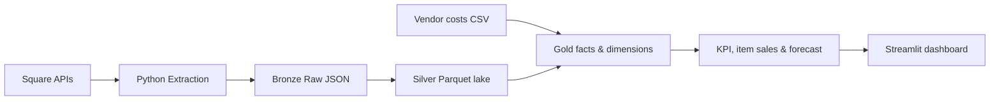

# RetailPulse Data Platform

A production-style data engineering portfolio project built from a real, operating liquor store's Square point-of-sale data.

## Business problem

The store runs entirely on Square, which means daily sales, catalog, payment, and (later) inventory data already exists — but it's locked inside Square's dashboard and reports. There's no reproducible, queryable history for answering questions like "which products are slow-moving," "how much revenue do discounts and refunds actually cost us," or "how does this week compare to last week." RetailPulse extracts that data into an owned pipeline so those questions can be answered with SQL instead of manual report-clicking.

It's built against a real store on purpose: the data shapes, edge cases, and volume are the ones a real commerce API produces, not a synthetic tutorial dataset. All development and testing happens against the **Square Sandbox** — see [Data privacy strategy](#data-privacy-strategy) below.

## Business questions this project answers

**Sales performance** — daily/weekly/monthly trends, best hours and days, average transaction value, items per basket, weekday vs. weekend, period-over-period comparisons.

**Product performance** — top sellers, category net sales, slow movers, trending items, frequently-bought-together pairs, seasonality.

**Payments and adjustments** — payment method mix, card vs. cash vs. other, revenue lost to discounts and refunds, Square processing fees, unusual refund/discount patterns.

**Inventory** *(future milestone)* — stockout risk, dead stock, turnover by item/category, days of inventory remaining, reorder recommendations.

**Profitability** *(future milestone, after vendor costs are added)* — gross profit and margin by product/category/vendor, and the financial effect of discounts, refunds, and fees.

> **Note:** Square sales data alone is *revenue*, not *profit*. Net sales and revenue are never described as profit in this project — true profit requires item acquisition costs from vendor invoices or a maintained cost dataset, which is a later milestone.

## Architecture



The whole pipeline runs as a **Dagster asset graph** — 42 assets, two scheduled
jobs, and two asset checks — with the dbt project loaded via `dagster-dbt` so all
30 models appear as individual assets with real lineage rather than one opaque
"run dbt" step. Orders and payments are partitioned by **store-local day**, so a
single day is the unit of both scheduling and backfill. See
[`docs/orchestration.md`](docs/orchestration.md).

```bash
make dagster   # asset graph, run history and backfills at localhost:3000
```

| Layer | Status | Description |
|---|---|---|
| Square APIs | Implemented (read-only) | Locations, Catalog, Orders, Payments, Inventory |
| Python Extraction | Implemented | Cursor-paginated, retrying, Sandbox by default (explicit opt-in for production) |
| Bronze Raw JSON | Implemented | Immutable, partitioned, local, Git-ignored |
| Silver Normalized Tables | Implemented | Deduplicated, flattened Parquet files (the local "lake") rebuilt from Bronze JSON |
| Gold Fact/Dimension Models | Implemented | `dbt-duckdb` models in `dbt/`, matching `sql/warehouse_schema.sql`'s target grain |
| KPI + margin + inventory | Implemented | Tested `kpi_*` models; payment reconciliation; gross-margin & inventory-position |
| Dashboard | Implemented | Streamlit app reading the tested KPI models |
| Orchestration | Implemented | Dagster asset graph: daily-partitioned ingest, retry policy, freshness + shape asset checks, two schedules |
| Forecasting | **Not implemented** — future work | Demand forecasting, reorder recommendations |

## Current focus: item-level sales analytics and forecasting

The heart of the platform: what each item sells, over time, and what it will sell next.

- **Item sales** (`kpi_item_sales`, `kpi_item_weekly_sales`): per-item units and revenue for any period the dashboard offers, each against the equivalent stretch before it, plus a full weekly history — built straight from order line items, so it works against any Square store with **no setup on the merchant's side**.
- **Forecasting** (`kpi_item_forecast`): projected units per item for the next 4 weeks, from a simple, explainable linear trend over recent weeks (falls back to a running average with little history). The trend is fitted on a **zero-filled** weekly series, so weeks an item didn't sell count against it rather than being dropped — without that, anything intermittent projects far too high. Honest estimates: calendar seasonality is a planned enhancement, not yet modeled.

### Everything is period-aware

`dim_period` defines the windows the dashboard offers (last 7 / 30 / 90 / 365 days, and all time), each with the equivalent window immediately before it. The KPI models are built at **(period, key)** grain, so switching period in the dashboard selects pre-computed, tested rows rather than triggering any recalculation in the presentation layer.

Two details that keep the comparisons truthful:

- Windows anchor on the **most recent day with sales**, not on today. Anchoring on today would drop empty days into the current window whenever the extract is stale and show a false decline.
- A comparison is **suppressed** (null, rendered as "—") when the extract doesn't fully cover the earlier window. Comparing a 90-day window against two days of prior history reads as +4,659%, which is worse than showing nothing.

### Optional: inventory and vendor costs (only active when you have that data)

M5 added inventory and gross-margin analysis, but both are **optional** and only light up when their source data exists — the pipeline never breaks without them:

- **Inventory** (`fact_inventory_snapshot`, `kpi_inventory_position`): read-only Square inventory counts → days-of-inventory + reorder signal. Still built and tested, but **not surfaced in the dashboard**: against the real store, 480 of 1,584 items carried negative on-hand counts (stock that was sold but never recorded as received), which made the reorder signal mostly noise. Reinstating it needs the counts corrected at source first.
- **Vendor costs → gross margin** (`fact_order_line_margin`, `kpi_margin_by_*`): if you maintain a Git-ignored `data/input/vendor_costs.csv`, the pipeline computes **COGS and gross profit** (`gross_profit = net_sales − COGS`). Margin is only computed where a cost is on file, and coverage is reported — profit is never fabricated from missing costs. No costs file → margin simply shows no coverage.
- **Production safeguard**: contacting production requires an explicit `RETAILPULSE_ALLOW_PRODUCTION=1` opt-in per command, so a real store can't be hit by accident. See [`docs/production-switch.md`](docs/production-switch.md) for the read-only production-validation guide.

### Earlier milestone — M4: KPI models, reconciliation, and dashboard

- **`dim_date`** and tested **KPI models** (`dbt/models/marts/kpi/`): daily sales, sales by category, by weekday, by hour, payment-method mix, and a single-row headline summary. Metric definitions live in version-controlled, tested SQL — not in the dashboard.
- **Reconciliation** (`rpt_order_payment_reconciliation` + a dbt test): every order's recorded total (net sales + tax) is asserted to equal what was collected in payments, order by order. This is *internal* reconciliation (the pipeline agrees with itself); reconciling against Square's own Reporting API totals is production-only future work (documented in [`docs/architecture.md`](docs/architecture.md)).
- **Design system** (`.streamlit/config.toml` + `dashboard/design.py`): the palette, type scale, radii and chart theme live in one place. Colours are a validated data-viz palette — categorical slot 1 (blue) and slot 2 (orange) on warm near-white / near-black surfaces — and both modes clear all six checks (lightness band, chroma floor, colour-vision-deficiency separation, normal-vision floor, contrast) against their own surface. The bulk goes through Streamlit's own theming API rather than CSS injected at generated class names, so it survives upgrades; `design.py` carries only what that API can't express, plus the matching Altair theme so the charts belong to the same system as the chrome.
- **Streamlit dashboard** (`dashboard/app.py`): a period control driving four tabs — Overview (KPI tiles with change vs. the previous equivalent window, daily sales trend, category and time-of-day breakdowns), Items (searchable, filterable item table with per-item history and projection), Forecast, and Back office (reconciliation, payment mix). It runs no business logic of its own — every number comes from a tested `kpi_*` model, so the dashboard and warehouse can't disagree. Search, filtering, sorting and top-N choose which model rows to show; they never compute a figure.

**Why DuckDB instead of a hosted warehouse:** DuckDB is a free, embedded, columnar OLAP database — no server, no account, no cost — and `dbt-duckdb` is an officially supported adapter. Reading Parquet directly off disk as the source layer is the same pattern real lakehouses use with S3 + Delta/Iceberg, just running locally. This keeps the warehouse layer genuinely representative of the modern data stack without requiring cloud credentials for a portfolio project.

## Technologies

Python 3.11 (the `<3.14` ceiling is enforced in `pyproject.toml` — see [`docs/orchestration.md`](docs/orchestration.md)), [httpx](https://www.python-httpx.org/) (HTTP client with retry/backoff), [pydantic](https://docs.pydantic.dev/) + [pydantic-settings](https://docs.pydantic.dev/latest/concepts/pydantic_settings/) (typed, secret-aware configuration), [DuckDB](https://duckdb.org/) (embedded OLAP engine + Parquet I/O), [dbt-duckdb](https://github.com/duckdb/dbt-duckdb) (SQL transformation + testing), [Dagster](https://dagster.io/) + [dagster-dbt](https://docs.dagster.io/integrations/dbt) (asset-based orchestration, partitions, backfills, asset checks), [Streamlit](https://streamlit.io/) (KPI dashboard), pytest + ruff (tests/lint), Square REST API `2026-07-15`.

## Data privacy strategy

- `.env` (holds the Square token) is Git-ignored and never committed, logged, or printed.
- Raw Square responses under `data/bronze/` are Git-ignored — only `data/.gitkeep` is tracked.
- This milestone runs against **Square Sandbox exclusively**; no production data is ever touched.
- Anything published from this project publicly (dashboards, screenshots) will use synthetic or aggregated data — never real customer, employee, or payment information.
- Full policy: [`docs/security-and-data-privacy.md`](docs/security-and-data-privacy.md).

## How to run

See [`docs/setup-guide.md`](docs/setup-guide.md) for full setup instructions. Quick reference:

```bash
cp .env.example .env
# open .env and paste your Square SANDBOX token — see docs/setup-guide.md
make install
make doctor
make check
make test
make lint
make security-check
make extract-sandbox
make silver
make dbt-build
```

Raw output lands under:

```text
data/bronze/square/<entity>/extracted_date=YYYY-MM-DD/*.json
```

Silver tables (the local lake) land under:

```text
data/silver/locations.parquet
data/silver/catalog_items.parquet
data/silver/order_lines.parquet
data/silver/payments.parquet
```

Gold tables land in a local DuckDB database file, `data/gold/warehouse.duckdb` — open it with `duckdb data/gold/warehouse.duckdb` and query `main_marts.dim_location`, `main_marts.dim_item`, `main_marts.fact_order_line`, `main_marts.fact_payment`, or any `main_marts.kpi_*` model directly.

### Dashboard

To see the KPI dashboard without configuring Square at all, build the warehouse from synthetic demo data and launch Streamlit:

```bash
make demo-data    # synthetic Bronze -> Silver -> dbt Gold + KPIs (no Square needed)
make dashboard    # opens the Streamlit dashboard at http://localhost:8501
```

`make demo-data` generates a deterministic ~6 weeks of fake orders/payments/inventory **and** synthetic vendor costs (clearly labeled synthetic — no real data), so the dashboard has margins and inventory to show. To run it against your own Square Sandbox data instead, use `make extract-sandbox && make silver && make dbt-build` before `make dashboard`.

### Orchestration

```bash
make dagster           # asset graph, run history, backfills at http://localhost:3000
make dagster-validate  # load every asset, check, job and schedule without running them
```

The UI is where the pipeline is easiest to read: the Bronze → Silver → dbt
lineage, which partitions have been filled, and the two asset checks. Backfilling
a range of store-days is a selection in the `square_orders` asset rather than a
script. Full detail in [`docs/orchestration.md`](docs/orchestration.md).

### Vendor costs (for gross-margin analysis)

Vendor/acquisition costs are **not** in Square — they're an operator-maintained input at `data/input/vendor_costs.csv` (Git-ignored; real cost data is never committed). Generate a synthetic one, or a fill-in template from your real catalog:

```bash
python3 scripts/generate_synthetic_vendor_costs.py   # reads data/silver/catalog_items.parquet
```

Edit `unit_cost_cents` / `vendor_name` with your real figures, then `make dbt-build` to recompute margins. Lines with no cost on file show up honestly as "no cost" rather than zero-cost.

## What's complete

- [x] Secure configuration (`SecretStr` token, `.env` Git-ignored, no secret in logs/errors)
- [x] Square client with cursor pagination, timeouts, and bounded retry/backoff; Sandbox by default with an explicit production opt-in
- [x] `retailpulse doctor` / `retailpulse check` diagnostics that never reveal the token
- [x] Immutable, partitioned Bronze JSON storage with `run_id` + `environment` metadata
- [x] Read-only extraction of locations, catalog, orders, payments, and inventory counts
- [x] Silver normalization written as Parquet (dedup, catalog join, line-item flattening, card-detail minimization, inventory snapshots)
- [x] dbt-duckdb Gold layer: dimensions, facts, and tested KPI models (sales, reconciliation, per-item sales, forecast, and optional margin/inventory)
- [x] **Per-item sales analytics** (`kpi_item_sales`, `kpi_item_weekly_sales`) — units and revenue per period vs. the equivalent window before it, plus weekly history
- [x] **Sales forecasting** (`kpi_item_forecast`) — projected units per item for the next 4 weeks (linear trend on a zero-filled series, honest fallback)
- [x] **Period-aware KPI layer** (`dim_period`) — every headline model built at (period, key) grain with prior-window comparisons, and comparisons suppressed where history doesn't support them
- [x] Optional gross margin (from operator-maintained vendor costs) — gracefully empty when that data doesn't exist, so a build never fails without it
- [x] Streamlit dashboard sourced entirely from the tested KPI models; margin section hidden when its data is absent
- [x] Local `make security-check` and full-pipeline CI (synthetic data → Silver → dbt build → dashboard smoke test → Dagster definitions validation) with zero credentials
- [x] **Dagster orchestration** — 42 assets end to end, daily-partitioned ingest on the store's calendar (DST-correct), exponential-backoff retries on the rate-limited Square API, two schedules, and asset checks for warehouse freshness and timezone regressions

## What's next

- M6: Deployment — public demo on synthetic data, plus a Dockerfile for the real pipeline
- Schema contracts at the Bronze→Silver boundary (Pydantic validation, dbt `contract: enforced`, source freshness)
- Incremental `fact_order_line` with a lookback window for late-arriving order edits
- M7: Webhook-driven incremental ingestion
- M8/M9: Demand forecasting and reorder recommendations

See [`docs/project-charter.md`](docs/project-charter.md) for the full charter, [`docs/data-dictionary.md`](docs/data-dictionary.md) for the model reference, and [`docs/production-switch.md`](docs/production-switch.md) to validate on your real store's data.
