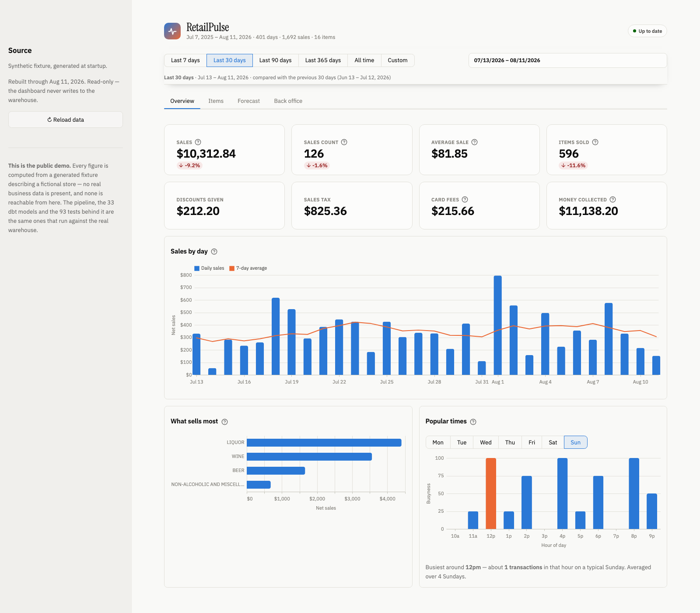
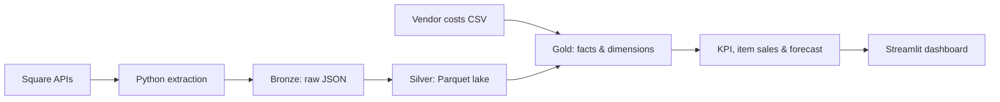

# RetailPulse

**A data platform over a real, operating liquor store's Square point-of-sale data** — extraction, a tested warehouse, orchestration, and a dashboard that answers the questions the owner actually asks.

[](https://github.com/christhesyrian/retailpulse-data-platform/actions/workflows/ci.yml)



*The hosted demo runs on a generated fixture — see [Try it](#try-it).*

## What it does, concretely

A year of the store's trade lands in a tested warehouse, and the questions that used to need clicking through Square's reports become SQL:

- **Peak trading hour is 16:00**, not the evening the owner assumed. That number was wrong for a year — see [the local-time bug](#the-bug-worth-reading-about).
- **Revenue forecast for tomorrow, the next week and the next month**, which backtests itself: on a 28-day holdout it is typically **within 11.0% of actual takings**, against **16.2%** for a flat daily average. Both figures are published in the dashboard, because a forecast that doesn't say how wrong it usually is invites you to trust it completely.
- **Per-item units and revenue** for any window, each against the equivalent window before it, with a 4-week projection per item.

The interesting part is not the charts. It is that **every number on screen comes from a tested warehouse object** — the dashboard computes nothing — and that the whole thing builds identically on three different warehouses.

## Try it

```bash
git clone https://github.com/christhesyrian/retailpulse-data-platform
cd retailpulse-data-platform
make install
make demo-data     # synthetic Bronze -> Silver -> dbt Gold + KPIs. No Square account needed.
make dashboard     # http://localhost:8501
```

No credentials, no cloud account, no Square access. `make demo-data` generates a deterministic fixture describing a fictional store, then runs the real pipeline over it.

> On a fresh clone this is safe. If you have already extracted real data, note that `make demo-data` writes synthetic pages *alongside* whatever is in `data/bronze/` rather than replacing it, and the Silver rebuild then reads both — so point it at an empty tree, or clear Bronze first.

The hosted demo does the same thing on boot: [`streamlit_app.py`](streamlit_app.py) generates the fixture, runs the Bronze→Silver transform, and builds all 33 dbt models and 94 tests before the first page renders — about 15 seconds, once per container. **No real business data is present in this repository or reachable from the demo.**

## Architecture



A **medallion architecture** — Bronze (immutable raw JSON), Silver (a normalised Parquet lake), Gold (a dimensional warehouse). The two halves are deliberately different shapes: Bronze → Silver is a classic **ETL** step, normalising and deduplicating Square's nested payloads in Python before anything is loaded; Silver → Gold is **ELT**, where every business transformation is version-controlled, tested SQL running inside the warehouse.

Gold is a **star schema**. Four fact tables (`fact_order_line`, `fact_payment`, `fact_inventory_snapshot`, `fact_order_line_margin`) join conformed dimensions (`dim_item`, `dim_location`, `dim_date`, `dim_vendor`, `dim_period`) on surrogate keys, and each model declares its grain.

The pipeline runs as a **Dagster asset graph** — 42 assets, two scheduled jobs and two asset checks — with the dbt project loaded through `dagster-dbt`, so all 33 models appear as individual assets with **column-level data lineage** rather than one opaque "run dbt" step. Orders and payments are partitioned by **store-local day**, so one day is the unit of both scheduling and backfill.

**Re-running is safe.** Bronze is append-only and immutable: each page is written to a partitioned path with the run id in the filename, and the writer refuses to overwrite. Silver then deduplicates to the latest version of each record, which makes the Silver and Gold rebuild **idempotent** — the warehouse is a pure function of Bronze, so running the pipeline twice produces the same warehouse rather than double-counting. That property is what makes a **backfill** of any store-day range a safe operation rather than a careful one.

**The Silver lake can live on S3.** Point `RETAILPULSE_SILVER_DIR` at an `s3://` prefix and the Parquet files are written to and read from object storage over DuckDB's `httpfs` extension — object store plus query engine, which is the shape of a lakehouse without the cluster. The contents are byte-identical either way and the models never learn where the files came from, because a source's `external_location` is just a string. See [Running against S3](#running-against-s3).

```bash
make dagster   # asset graph, run history and backfills at localhost:3000
```

| Layer | Status | Notes |
|---|---|---|
| Square APIs | Implemented (read-only) | Locations, catalog, orders, payments, inventory |
| Extraction | Implemented | Cursor-paginated, bounded retry/backoff, Sandbox by default with an explicit production opt-in |
| Bronze | Implemented | Immutable, partitioned, local, Git-ignored |
| Silver | Implemented | Deduplicated, flattened Parquet, rebuilt from Bronze |
| Gold | Implemented | 33 `dbt` models — dimensions, facts, and the KPI layer; `fact_order_line` is incremental |
| Forecasting | Implemented | Per-item units (4 weeks) and revenue (31 days), both backtested |
| Dashboard | Implemented | Streamlit, reading only tested models |
| Orchestration | Implemented | Dagster: daily-partitioned ingest, retries, freshness and timezone asset checks, two schedules |
| Portability | Implemented | The same models build on DuckDB, Snowflake and BigQuery |

## The parts worth reviewing

If you are assessing this as engineering rather than as a dashboard, these are the five things to look at.

### One set of models, three warehouses — and a script that proves it

`dbt build` runs green on **DuckDB, Snowflake and BigQuery**: all 127 nodes, same models, same tests. Dialect differences are isolated behind adapter-dispatched macros in [`dbt/macros/portable.sql`](dbt/macros/portable.sql), and the parameterized range API in [`dbt/macros/range_api.sql`](dbt/macros/range_api.sql) publishes one body as a DuckDB table macro, a Snowflake SQL UDTF or a BigQuery table function.

The point is what that exercise turns up. A green build on three warehouses only proves the SQL *parses* on each — so [`scripts/compare_warehouses.py`](scripts/compare_warehouses.py) runs the same twelve queries against all three and demands the same answers back:

```bash
python3 scripts/compare_warehouses.py
```

It found a real bug that no build would ever catch: BigQuery's `extract(week from ...)` counts weeks from the first Sunday of the year, so `dim_date.week_of_year` read 29 where the ISO answer is 30, in a column no test asserted. The same class of thing hides in `dayname` ("Monday" on DuckDB, "Mon" on Snowflake) and `date_trunc(x, WEEK)` (Sunday on BigQuery, Monday elsewhere). All of them compile everywhere and mean different things.

Ten of the twelve checks require exact agreement. Two allow 0.01%, documented in the script: forecast units and backtest error are rounded floating-point regression output, and last-bit differences tip 14 of 8,432 rows across a rounding boundary by exactly one unit each.

### Data quality is the point, not a section at the end

**94 dbt tests** and **75 pytest tests** run on every push, plus two Dagster **asset checks** that catch what tests cannot.

The distinction the suite is built around: a schema test tells you a column is non-null; it does not tell you the number is *right*. So alongside the `unique`/`not_null`/`accepted_values` coverage there are seven singular tests asserting business invariants — that a period never reports more sales than the period containing it, that every order's recorded total equals what was collected, that the custom-range API agrees exactly with the precomputed models, that no forecast is NaN or negative, that the calendar spine covers every day with sales, and that the incremental fact table still matches its source.

The asset checks cover the failure modes that leave everything green:

- **`sales_are_fresh`** — a **freshness SLA of two days**. Every model can build, every test can pass, and the dashboard can look healthy while showing data that stopped updating a week ago, because "no new rows" breaks no constraint.
- **`peak_hour_is_within_business_hours`** — a timezone-regression guard. If the busiest hour of the day drifts outside plausible trading hours, something has reintroduced the UTC bug below.

That is what **pipeline observability** means here: not a dashboard of green ticks, but named checks for the specific ways this pipeline can lie to you.

### The bug worth reading about

Square records every sale in UTC. A store in California does its heaviest trade in the evening, which is already the next day in UTC — so reading the date straight off the timestamp put a year of Friday-evening sales on Saturday. **Every total still reconciled.** Daily revenue was right, monthly revenue was right, and the error was invisible until someone noticed the hour-of-day chart peaking at 2am.

Local time is now resolved once, in the fact layer, through the `to_local_time` macro, and [`dbt/tests/assert_local_time_conversion.sql`](dbt/tests/assert_local_time_conversion.sql) asserts three independent things about it — including that the offset is a whole number of hours between 1 and 23, so a conversion that silently no-ops fails the build.

That is the theme of the test suite generally: the failures worth guarding against are the ones that still produce a plausible number.

### Custom date ranges that cannot drift from the presets

The precomputed `kpi_*` models are built at `(period, key)` grain, which is exactly what makes an arbitrary window impossible — there is no row for "March 3rd to April 11th". Rather than move that aggregation into the dashboard, the same SQL is published as parameterized warehouse relations taking `(start, end)`.

That creates two ways to compute the same KPI, so [`assert_range_macros_match_periods`](dbt/tests/assert_range_macros_match_periods.sql) requires them to agree exactly on all five canonical windows. It caught 168 real mismatches the first time it ran, and it runs on every warehouse.

### The incremental model, and the filter that would have been wrong

`fact_order_line` is the one **incremental** model — the largest table, and the reason a full rebuild of everything else stays cheap. The obvious implementation is:

```sql
where closed_at > (select max(closed_at) from this_table)
```

It compiles, it runs fast, and it is wrong. Square lets an order be amended after it closes — a refund, a corrected price — and that edit changes a row whose `closed_at` is still last Tuesday. A filter on "newer than the newest thing I have" **never sees it**. The warehouse drifts from the source and nothing errors.

So the filter is on `order_updated_at` — when the record *changed*, not when the sale *happened* — with a seven-day lookback for the gap between an edit landing in Square and the extract that collects it. The strategy is `merge` on a hash of the natural key, which is also why the surrogate key is no longer `row_number()`: a positional key is only stable while the whole table is rebuilt at once.

Two things keep it honest:

- [`assert_fact_matches_source`](dbt/tests/assert_fact_matches_source.sql) compares the fact table against staging on every build — row counts, distinct keys and totals. That catches all three ways an incremental table drifts: rows missed, rows duplicated, rows left stale.
- [`scripts/verify_incremental.py`](scripts/verify_incremental.py) proves the hard case end to end. It builds a warehouse, runs incrementally with no changes (must be a no-op), amends an order that closed months ago, runs incrementally again, and requires both that the edit arrived **and** that the result is identical to a full rebuild, row for row.

```bash
python3 scripts/verify_incremental.py
```

The known limitation, stated rather than hidden: `merge` matches on key, so a line item *removed* upstream leaves a stale row. Square models voids as a state change rather than a deletion, so it hasn't come up here — and `assert_fact_matches_source` would fail if it did.

### A forecast that reports its own error

`kpi_revenue_forecast` holds out the most recent 28 days, fits on everything before them, predicts those days and publishes the weighted absolute percentage error — next to the same figure for a naive flat average. If the model isn't beating the baseline, the dashboard says so.

WAPE rather than MAPE, deliberately: MAPE divides by each day's actual, so one partially-extracted day with $24 of sales against a $3,400 forecast is a 14,000% error on its own. It dragged the reported figure to 464% while every ordinary day was within a few percent.

## Data privacy

This repository is public. The store's data is not, and the separation is enforced rather than promised.

- **Nothing derived from the real store is committed.** `data/` is Git-ignored except for `.gitkeep`; the Bronze layer is ~800MB of real business data that lives only on the owner's machine.
- **`.env` holds the Square token**, is Git-ignored, and is never logged or printed. [`scripts/security_check.py`](scripts/security_check.py) scans the tree for secret-shaped patterns and runs in CI on every push.
- **CI has no credentials at all.** It generates a synthetic fixture and runs the entire pipeline over it — Bronze → Silver → dbt build → dashboard smoke test → Dagster validation.
- **The hosted demo is synthetic**, generated at boot. It has no Square token and no path to one.
- **Development uses the Square Sandbox by default.** Reaching the real store requires an explicit `RETAILPULSE_ALLOW_PRODUCTION=1` per command, and every production call the project makes is read-only — see [`docs/production-switch.md`](docs/production-switch.md).

Full policy: [`docs/security-and-data-privacy.md`](docs/security-and-data-privacy.md).

## Business questions it answers

**Sales performance** — daily and weekly trends, best hours and days, average transaction value, items per basket, weekday vs. weekend, period-over-period comparisons.

**Product performance** — top sellers, category net sales, slow movers, trending items, per-item weekly history and projection.

**Payments and adjustments** — payment-method mix, revenue lost to discounts, Square processing fees, and an order-by-order reconciliation between recorded totals and money collected.

**Gross margin** *(optional)* — only where vendor costs are on file, with coverage reported. Profit is never fabricated from missing costs.

> Square sales data alone is *revenue*, not *profit*. Net sales is never described as profit in this project.

Two details that keep comparisons truthful: windows anchor on the **most recent day with sales**, not on today, so a stale extract doesn't manufacture a decline; and a comparison is **suppressed** rather than shown when the extract doesn't fully cover the earlier window, because a 90-day window against two days of prior history reads as +4,659%.

### Deliberately built but not surfaced

Inventory (`kpi_inventory_position`) and gross margin are implemented and tested but **absent from the dashboard**. Against the real store, 480 of 1,584 items carried negative on-hand counts — stock sold but never recorded as received — which made the reorder signal noise. Reinstating it needs the counts corrected at source. Shipping a confident-looking number built on data that doesn't support it is the failure mode worth avoiding.

## Running the real pipeline

See [`docs/setup-guide.md`](docs/setup-guide.md) for full instructions.

```bash
cp .env.example .env    # paste a Square Sandbox token — see docs/setup-guide.md
make install
make doctor             # diagnostics that never reveal the token
make extract-sandbox
make silver
make dbt-build          # 125 pass, 1 intentional warning
```

Gold tables land in `data/gold/warehouse.duckdb`. Open it with `duckdb data/gold/warehouse.duckdb` and query `main_marts.fact_order_line` or any `main_marts.kpi_*` model directly.

Once it's set up, refreshing is one command:

```bash
make refresh              # pull the last 14 days, rebuild Silver and the warehouse
make refresh DAYS=30      # wider window; overlap is free, Silver dedupes
make refresh-all          # ...then push to Snowflake and BigQuery and check all three agree
```

Against a production token the extract step still requires `RETAILPULSE_ALLOW_PRODUCTION=1`, so `make refresh` run by accident stops with an explanation rather than calling the real store.

```bash
make test lint security-check   # 58 pytest, ruff, credential scan
make dagster-validate           # load every asset, check, job and schedule
```

### Other warehouses

```bash
make sync-cloud           # load Silver into every configured warehouse, then build each
make compare-warehouses   # ...and require them to return the same answers
```

Either one skips a warehouse whose credentials aren't in the environment, so a clone with no cloud accounts runs both happily and is told why nothing happened. The individual steps, if you want them:

```bash
python3 scripts/load_silver_to_snowflake.py     # or load_silver_to_bigquery.py
RETAILPULSE_DBT_TARGET=snowflake dbt build --project-dir dbt --profiles-dir dbt
```

The models are portable; the *ingestion* is not, which is why each cloud target has its own loader. `external_location` is a dbt-duckdb feature — every other adapter needs Silver physically loaded. That is the honest shape of a warehouse migration.

### Running against S3

Provision the bucket and a least-privilege IAM user with Terraform, then point the pipeline at it:

```bash
cd infra/aws && terraform init && terraform apply -var bucket_name=<globally-unique-name>
```

```bash
export RETAILPULSE_SILVER_DIR="s3://<your-bucket>/silver"   # terraform output silver_dir
export AWS_ACCESS_KEY_ID=... AWS_SECRET_ACCESS_KEY=... AWS_REGION=us-east-1

retailpulse transform-silver                                 # writes Parquet to S3
RETAILPULSE_DBT_TARGET=dev_s3 dbt build --project-dir dbt --profiles-dir dbt
```

The `dev_s3` target is the same DuckDB warehouse as `dev` with `httpfs` loaded and an S3 secret — only the source location differs. Terraform deliberately creates **no access key**: that would write the secret into local state in plaintext, so the IAM user is created and you mint a key for it yourself, or attach the policy to a role and skip long-lived keys entirely.

**You don't need an AWS account to exercise this path.** Set `AWS_ENDPOINT_URL_S3` to any S3-compatible endpoint and it works unchanged — which is how it was developed and verified, against MinIO in Docker:

```bash
docker run -d --name minio -p 9000:9000 \
  -e MINIO_ROOT_USER=retailpulse -e MINIO_ROOT_PASSWORD=retailpulse-local-only \
  minio/minio server /data
export AWS_ENDPOINT_URL_S3=http://localhost:9000 \
       AWS_ACCESS_KEY_ID=retailpulse AWS_SECRET_ACCESS_KEY=retailpulse-local-only
```

All 126 nodes build green with Silver read from object storage.

## Technologies

**Languages & modelling** — Python 3.11, SQL, dimensional modelling (star schema, conformed dimensions, surrogate keys, declared grain), ELT, medallion architecture

**Warehouses** — [DuckDB](https://duckdb.org/), [Snowflake](https://www.snowflake.com/), [BigQuery](https://cloud.google.com/bigquery); [dbt](https://www.getdbt.com/) via `dbt-duckdb` / `dbt-snowflake` / `dbt-bigquery`

**Orchestration** — [Dagster](https://dagster.io/) + dagster-dbt (assets, daily partitions, backfills, asset checks, schedules) and a parallel [Airflow](https://airflow.apache.org/) DAG for comparison

**Storage & platform** — Parquet on local disk or **AWS S3** (read by DuckDB over `httpfs`; MinIO-compatible for local development), Docker & Compose, [Terraform](https://www.terraform.io/) for both clouds — AWS (S3 bucket, versioning, encryption, lifecycle rules, least-privilege IAM policy and user) and GCP (Cloud Storage, BigQuery dataset, service account, IAM) — GitHub Actions CI/CD

**Data quality** — dbt tests and contracts, custom singular tests for business invariants, Dagster asset checks, freshness SLA, `scripts/compare_warehouses.py`

**Ingestion & presentation** — [httpx](https://www.python-httpx.org/) with bounded retry/backoff against the Square REST API `2026-07-15`, [pydantic](https://docs.pydantic.dev/) + pydantic-settings for typed secret-aware config, [Streamlit](https://streamlit.io/) + Altair, pytest + ruff

**Why DuckDB as the default:** it is a free, embedded, columnar OLAP engine, and reading Parquet directly off disk is the same pattern a lakehouse uses with S3 and Iceberg, minus the account. Anyone can clone this repo and get a working warehouse in one command — which is also why the Snowflake and BigQuery targets exist: to show the choice is not a constraint.

## What's next

- Schema contracts at the Bronze→Silver boundary — Pydantic at the edge, dbt `contract: enforced` on staging, source freshness
- A second source: supplier invoices, which forces real entity resolution between invoice text and the Square catalog

See [`docs/project-charter.md`](docs/project-charter.md) for the charter, [`docs/data-dictionary.md`](docs/data-dictionary.md) for the model reference, and [`docs/orchestration.md`](docs/orchestration.md) for the asset graph.
