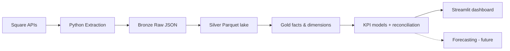

# RetailPulse Data Platform

A production-style data engineering portfolio project built from a real, operating liquor store's Square point-of-sale data.

## Business problem

The store runs entirely on Square, which means daily sales, catalog, payment, and (later) inventory data already exists — but it's locked inside Square's dashboard and reports. There's no reproducible, queryable history for answering questions like "which products are slow-moving," "how much revenue do discounts and refunds actually cost us," or "how does this week compare to last week." RetailPulse extracts that data into an owned pipeline so those questions can be answered with SQL instead of manual report-clicking.

It's built against a real store on purpose: the data shapes, edge cases, and volume are the ones a real commerce API produces, not a synthetic tutorial dataset. All development and testing happens against the **Square Sandbox** — see [Data privacy strategy](#data-privacy-strategy) below.

## Business questions this project answers

**Sales performance** — daily/weekly/monthly trends, best hours and days, average transaction value, items per basket, weekday vs. weekend, period-over-period comparisons.

**Product performance** — top sellers, category net sales, slow movers, trending items, frequently-bought-together pairs, seasonality.

**Payments and adjustments** — payment method mix, card vs. cash vs. other, revenue lost to discounts and refunds, Square processing fees, unusual refund/discount patterns.

**Inventory** *(future milestone)* — stockout risk, dead stock, turnover by item/category, days of inventory remaining, reorder recommendations.

**Profitability** *(future milestone, after vendor costs are added)* — gross profit and margin by product/category/vendor, and the financial effect of discounts, refunds, and fees.

> **Note:** Square sales data alone is *revenue*, not *profit*. Net sales and revenue are never described as profit in this project — true profit requires item acquisition costs from vendor invoices or a maintained cost dataset, which is a later milestone.

## Architecture



| Layer | Status | Description |
|---|---|---|
| Square APIs | Implemented (read-only) | Locations, Catalog, Orders, Payments |
| Python Extraction | Implemented | Cursor-paginated, retrying, sandbox-only |
| Bronze Raw JSON | Implemented | Immutable, partitioned, local, Git-ignored |
| Silver Normalized Tables | Implemented | Deduplicated, flattened Parquet files (the local "lake") rebuilt from Bronze JSON |
| Gold Fact/Dimension Models | Implemented | `dbt-duckdb` models in `dbt/`, matching `sql/warehouse_schema.sql`'s target grain |
| KPI models + reconciliation | Implemented | Tested `kpi_*` dbt models; per-order payment reconciliation |
| Dashboard | Implemented | Streamlit app reading the tested KPI models |
| Forecasting | **Not implemented** — future work | Demand forecasting, reorder recommendations |

## Current milestone: M4 — KPI models, reconciliation, and dashboard

M1–M3 (Sandbox ingestion → Silver normalization → dbt dimensional models) are complete. M4 adds the analytics layer on top of the Gold facts/dimensions:

- **`dim_date`** and tested **KPI models** (`dbt/models/marts/kpi/`): daily sales, sales by category, by weekday, by hour, payment-method mix, and a single-row headline summary. Metric definitions live in version-controlled, tested SQL — not in the dashboard.
- **Reconciliation** (`rpt_order_payment_reconciliation` + a dbt test): every order's recorded total (net sales + tax) is asserted to equal what was collected in payments, order by order. This is *internal* reconciliation (the pipeline agrees with itself); reconciling against Square's own Reporting API totals is production-only future work (documented in [`docs/architecture.md`](docs/architecture.md)).
- **Streamlit dashboard** (`dashboard/app.py`): KPI tiles, daily sales trend, category/weekday/hour breakdowns, payment mix, and a live reconciliation status banner. It runs no business logic of its own — every number comes from a tested `kpi_*` model, so the dashboard and warehouse can't disagree.

**Why DuckDB instead of a hosted warehouse:** DuckDB is a free, embedded, columnar OLAP database — no server, no account, no cost — and `dbt-duckdb` is an officially supported adapter. Reading Parquet directly off disk as the source layer is the same pattern real lakehouses use with S3 + Delta/Iceberg, just running locally. This keeps the warehouse layer genuinely representative of the modern data stack without requiring cloud credentials for a portfolio project.

## Technologies

Python 3.11+, [httpx](https://www.python-httpx.org/) (HTTP client with retry/backoff), [pydantic](https://docs.pydantic.dev/) + [pydantic-settings](https://docs.pydantic.dev/latest/concepts/pydantic_settings/) (typed, secret-aware configuration), [DuckDB](https://duckdb.org/) (embedded OLAP engine + Parquet I/O), [dbt-duckdb](https://github.com/duckdb/dbt-duckdb) (SQL transformation + testing), [Streamlit](https://streamlit.io/) (KPI dashboard), pytest + ruff (tests/lint), Square REST API `2026-07-15`.

## Data privacy strategy

- `.env` (holds the Square token) is Git-ignored and never committed, logged, or printed.
- Raw Square responses under `data/bronze/` are Git-ignored — only `data/.gitkeep` is tracked.
- This milestone runs against **Square Sandbox exclusively**; no production data is ever touched.
- Anything published from this project publicly (dashboards, screenshots) will use synthetic or aggregated data — never real customer, employee, or payment information.
- Full policy: [`docs/security-and-data-privacy.md`](docs/security-and-data-privacy.md).

## How to run

See [`docs/setup-guide.md`](docs/setup-guide.md) for full setup instructions. Quick reference:

```bash
cp .env.example .env
# open .env and paste your Square SANDBOX token — see docs/setup-guide.md
make install
make doctor
make check
make test
make lint
make security-check
make extract-sandbox
make silver
make dbt-build
```

Raw output lands under:

```text
data/bronze/square/<entity>/extracted_date=YYYY-MM-DD/*.json
```

Silver tables (the local lake) land under:

```text
data/silver/locations.parquet
data/silver/catalog_items.parquet
data/silver/order_lines.parquet
data/silver/payments.parquet
```

Gold tables land in a local DuckDB database file, `data/gold/warehouse.duckdb` — open it with `duckdb data/gold/warehouse.duckdb` and query `main_marts.dim_location`, `main_marts.dim_item`, `main_marts.fact_order_line`, `main_marts.fact_payment`, or any `main_marts.kpi_*` model directly.

### Dashboard

To see the KPI dashboard without configuring Square at all, build the warehouse from synthetic demo data and launch Streamlit:

```bash
make demo-data    # synthetic Bronze -> Silver -> dbt Gold + KPIs (no Square needed)
make dashboard    # opens the Streamlit dashboard at http://localhost:8501
```

`make demo-data` generates a deterministic ~6 weeks of fake orders/payments (clearly labeled synthetic — no real data), so the dashboard has something meaningful to show. To run it against your own Square Sandbox data instead, use `make extract-sandbox && make silver && make dbt-build` before `make dashboard`.

## What's complete

- [x] Secure configuration (`SecretStr` token, `.env` Git-ignored, no secret in logs/errors)
- [x] Square Sandbox client with cursor pagination, timeouts, and bounded retry/backoff for transient errors
- [x] `retailpulse doctor` / `retailpulse check` diagnostics that never reveal the token
- [x] Immutable, partitioned Bronze JSON storage with `run_id` + `environment` metadata
- [x] Unit tests for pagination, retry behavior, config secrecy, and storage immutability
- [x] Local `make security-check` and credential-free GitHub Actions CI
- [x] Silver normalization: dedup by Square object ID, catalog item/variation/category join, order line-item flattening, payment card-detail minimization, written as Parquet
- [x] dbt-duckdb Gold layer: `dim_location`, `dim_item`, `fact_order_line`, `fact_payment` with schema tests, built from Silver Parquet with no Square access needed
- [x] KPI models (daily/category/weekday/hour/payment-mix/summary) and per-order payment reconciliation, all tested in dbt
- [x] Streamlit KPI dashboard sourced entirely from the tested KPI models
- [x] Full-pipeline CI: synthetic Bronze fixture -> Silver -> dbt build -> dashboard-query smoke test, verified on every push with zero credentials

## What's next

- M5: Inventory snapshots and vendor-cost ingestion for margin analysis
- M6: Orchestration, observability, and cloud deployment
- M7: Webhook-driven incremental ingestion
- M8: Demand forecasting and reorder recommendations

See [`docs/project-charter.md`](docs/project-charter.md) for the full project charter and [`docs/data-dictionary.md`](docs/data-dictionary.md) for expected entity fields.
