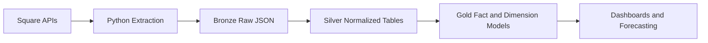

# Architecture



## Layers

### Square APIs (implemented, read-only)

`src/retailpulse/square_client.py` calls four read-only Square REST endpoints:

- `GET /v2/locations`
- `GET /v2/catalog/list`
- `POST /v2/orders/search`
- `GET /v2/payments`

Requests carry `Authorization: Bearer <token>`, `Square-Version`, and a descriptive `User-Agent`. Transient failures (HTTP 429/500/502/503/504, and transport-level errors) are retried up to 5 attempts with exponential backoff and jitter, honoring `Retry-After` when Square sends it. Authentication and validation errors (4xx other than 429) fail immediately without retry, since retrying them cannot succeed.

### Python Extraction (implemented)

`src/retailpulse/extract/jobs.py` orchestrates one job per entity (locations, catalog, orders, payments), each following Square's cursor pagination until no `cursor` is returned, writing one raw page per API response.

### Bronze Raw JSON (implemented)

`src/retailpulse/storage.py` writes each page as an immutable, metadata-wrapped JSON file:

```text
data/bronze/square/<entity>/extracted_date=YYYY-MM-DD/page-00001-<timestamp>-<run_id>.json
```

```json
{
  "metadata": {
    "source": "square",
    "entity": "orders",
    "page_number": 1,
    "extracted_at": "2026-07-22T12:00:00+00:00",
    "run_id": "a1b2c3d4...",
    "environment": "sandbox"
  },
  "payload": { "...": "raw Square API response, unmodified" }
}
```

The filename embeds a per-run identifier, so two extraction runs never collide even within the same partition, and `write_raw_page` refuses to overwrite an existing path (`FileExistsError`). This directory is Git-ignored; it never leaves the local machine.

### Silver Normalized Tables (implemented)

`src/retailpulse/transform/silver.py` reads every Bronze JSON file for an entity (across every extraction run), deduplicates by the Square object's own `id`, and writes flattened CSV tables to `data/silver/`:

- **`locations.csv`** — one row per location.
- **`catalog_items.csv`** — one row per catalog item *variation*, joined against its parent `ITEM` and `CATEGORY` objects (Square's Catalog API returns these as separate flat objects; Silver resolves the `item_id`/`category_id` links). `category_name` is `null` when an item has no category assigned — this is reported honestly rather than guessed.
- **`order_lines.csv`** — one row per order line item, flattening Square's nested `order.line_items[]` array. Money fields (`gross_sales_cents`, `discount_cents`, `tax_cents`, `net_sales_cents`) come straight from the line item's own computed totals.
- **`payments.csv`** — one row per payment. Card details are **minimized**: only `card_brand` and `card_last_4` are kept; `fingerprint` and `bin` from the raw Bronze payload are dropped, since Silver is the layer future exports and dashboards read from.

**Dedup rule:** for each Square object type, the record's own `updated_at` field (when present) determines which extraction run's snapshot wins, falling back to the Bronze `extracted_at` timestamp otherwise (locations don't carry their own `updated_at`). Since the same order/payment/catalog object is re-extracted on every run within its lookback window, this collapses N snapshots down to 1 current row per object — Silver is a rebuild, not an append: each `make silver` run regenerates the CSVs from scratch from whatever Bronze currently holds.

Run it with `make silver` or `retailpulse transform-silver`.

### Gold Fact and Dimension Models — not implemented (future work)

`sql/warehouse_schema.sql` documents the target grain (`fact_order_line`, `fact_payment`, `dim_location`, `dim_item`, and — later — `fact_refund`, `fact_inventory_snapshot`, `dim_category`, `dim_date`). Intended to be implemented as dbt models with tests once Silver is validated.

### Dashboards and Forecasting — not implemented (future work)

KPI dashboard reconciled against Square's own reporting, followed by demand forecasting and reorder recommendations.

## Configuration and secrets

`src/retailpulse/config.py` loads settings via `pydantic-settings`, typing the access token as `SecretStr` so it can't leak into a `repr()`, log line, or exception message. `SQUARE_ENVIRONMENT` defaults to `sandbox`; selecting `production` triggers a visible CLI warning before any request is made. See [`security-and-data-privacy.md`](security-and-data-privacy.md) for the full policy.
