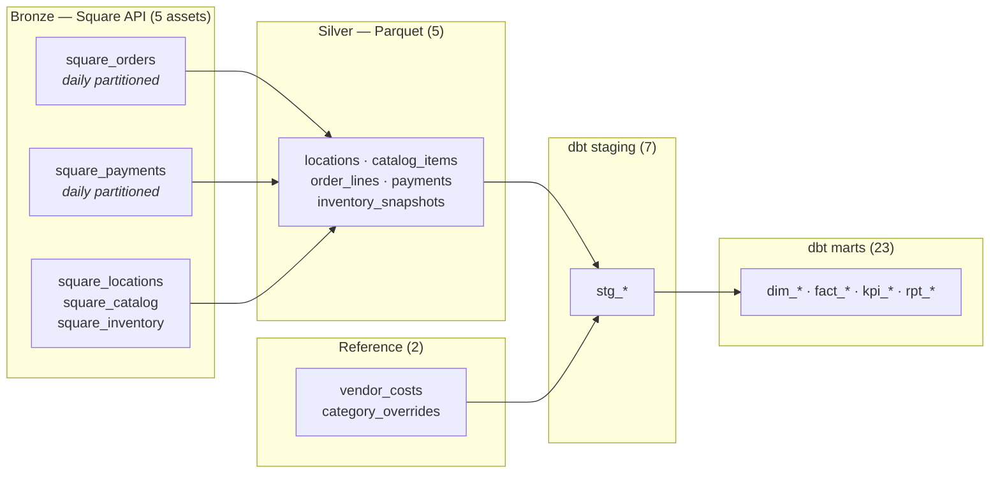

# Orchestration

The pipeline runs as a Dagster asset graph: **42 assets, 80 dependency edges,
two schedules, two asset checks**. Every step is wrapped, not rewritten — the
`retailpulse` CLI still runs the same pipeline unattended if Dagster is not
there.

```bash
make dagster          # UI at localhost:3000
make dagster-validate # load the whole graph without running it (what CI does)
```

## Why Dagster rather than Airflow

This pipeline's unit of work is *a table that should exist*, not *a task that
should run*. Dagster models that directly: `silver/order_lines` is an asset with
a definition and a lineage, and "rebuild everything downstream of the catalog"
is expressible without hand-maintaining a task graph.

The decisive part is `dagster-dbt`. It reads the dbt manifest and turns all 30
models into individual assets, so dbt lineage and Python lineage live in one
graph instead of dbt being a single opaque `BashOperator`. A failing model names
itself; a downstream-only rebuild is one selection away.

## The asset graph



The Python assets and the dbt models are joined **by asset key, not by
configuration**. dagster-dbt keys a dbt source as `[source_name, table_name]`,
so `silver.order_lines` in `dbt/models/staging/_sources.yml` resolves to
`AssetKey(["silver", "order_lines"])` — exactly the key the `silver_tables`
multi-asset emits. Rename either side and the graph silently splits into two
halves that both still build, losing lineage without erroring, which is why
`tests/test_orchestration_definitions.py` asserts those edges exist.

## Partitioning is on the store's calendar, not UTC

Orders and payments are partitioned by **store-local day**
(`America/Los_Angeles`). This is the same correctness issue that
`fact_order_line` already solves for reporting, applied one layer earlier.

A liquor store does its heaviest trade in the evening, which is already the next
day in UTC. A partition built on UTC midnights would split Tuesday evening
across two partitions and file it under Wednesday. `partition_utc_window()`
converts a local calendar day into the UTC window Square's API expects, which
means the DST boundaries come out at **23 and 25 hours** rather than always 24 —
tested explicitly in `tests/test_orchestration_partitions.py`, including that
consecutive days tile with no gap or overlap.

Snapshot assets (locations, catalog, inventory) are deliberately **not**
partitioned: Square reports them as of now and exposes no historical window, so
a partition would promise a backfill that cannot be performed.

## Backfills

Bronze is append-only. Re-running a partition does not overwrite the earlier
file — it writes a second immutable snapshot, because the first is still a
truthful record of what Square returned then. Idempotency comes one layer later:
`run_silver_transform` dedupes on each table's natural key, latest-write-wins.
So a backfill is always safe to re-run, and no raw data is ever mutated.

Each partition also resolves its own active locations from Square rather than
reading them from the `square_locations` asset, so a backfilled day never
depends on a pickled value left behind by an unrelated run.

To backfill: open the asset in the UI → **Materialize** → select a partition
range, or

```bash
dagster asset materialize -m retailpulse.orchestration.definitions \
  --select square_orders --partition 2026-03-08
```

## Failure semantics

**Retries.** The Square assets carry
`RetryPolicy(max_retries=3, delay=15, backoff=EXPONENTIAL, jitter=PLUS_MINUS)`.
Square rate-limits, and an unattended 2am run has to survive that without a
human. Jitter matters specifically for backfills: without it, many partitions
launched together retry in lockstep and re-trigger the same limit.

**A failed ingest does not corrupt anything.** The refresh job reads whatever
Bronze holds, so a missed ingest yields a warehouse that is one day behind, not
a broken one. `sales_are_fresh` is what makes that visible rather than silent.

## Asset checks

These ask questions dbt tests cannot: dbt tests assert things about rows within
a build, these assert things about the warehouse as an operating system.

| Check | Asset | Asks |
| --- | --- | --- |
| `sales_are_fresh` | `marts/fact_order_line` | Is the newest sale more than 2 days old? |
| `peak_hour_is_within_business_hours` | `marts/kpi_sales_by_hour` | Is the busiest hour still plausible? |

`sales_are_fresh` catches the failure mode nothing else does: every model builds,
every test passes, and the dashboard looks healthy while showing data that
stopped updating a week ago — because "no new rows" violates no constraint.

`peak_hour_is_within_business_hours` encodes this project's most expensive bug as
a test. Sales were attributed to the UTC calendar day for a year; every total
reconciled and every test passed. It was found by noticing the hour-of-day chart
peaked at 2am. The check asserts the *shape*, not the totals, so a future
regression that re-derives an hour from UTC fails immediately instead of a year
later.

## Schedules

| Schedule | Cron (store time) | Job |
| --- | --- | --- |
| `square_ingest_job_schedule` | `0 2 * * *` | Extract the completed day into Bronze |
| `warehouse_refresh_schedule` | `45 2 * * *` | Rebuild Silver, then `dbt build` |

There are two jobs because Dagster requires every asset in a job to share a
partitioning scheme, and this pipeline honestly has two: a per-day event stream
and a full refresh. Faking a partition on the refresh side would claim a per-day
rebuild that does not happen.

The 45-minute offset is a time coupling rather than a hard dependency, which is
a deliberate trade: the refresh is correct at any time because it reads whatever
Bronze holds. The cost is that a very slow ingest could be missed by that day's
refresh and picked up by the next. Both schedules run on the **store's** clock,
so "yesterday" keeps meaning yesterday to the merchant.

## Operational notes

- `DAGSTER_HOME` must be an absolute path that exists, or Dagster silently uses
  a temporary instance and forgets every run on exit. `make dagster` handles it.
- `dagster-dbt` reads `dbt/target/manifest.json` **at import time** to build the
  asset graph, so `dbt parse` has to run before anything imports the
  definitions. That is why CI parses before it tests.
- The Python ceiling in `pyproject.toml` (`<3.14`) is load-bearing: no
  `dagster-dbt` wheel installs on 3.14, and without the ceiling pip backtracks
  to a 2023-era dagster and drags dbt-core down to 1.7 to satisfy it.

## Known limits

- Bronze accumulates one snapshot per run and is never compacted. Fine at
  current volume; a real deployment would age old raw pages out to cold storage.
- The refresh rebuilds Silver from all of Bronze every night. That is honest and
  cheap today (~3 minutes over a year of data) but is the first thing that will
  need to become incremental — see the incremental `fact_order_line` work.
- `dim_period` anchors globally on the latest day with sales. With locations in
  different timezones, both that and the partition timezone become per-location.
